# DevDash — The Physical Developer Companion

> An always-on Raspberry Pi 5 desk device that bridges the gap between your codebase and the physical world — powered by the GitHub Copilot SDK.


## What It Does

DevDash turns a Raspberry Pi 5 with a 3.5" touch screen into an AI-powered developer companion that GitHub Desktop literally cannot be:

| Feature | Description |
|---------|-------------|
| 🧠 **CI Auto-Diagnosis** | Copilot reads CI logs, traces errors to commits, suggests fixes, creates fix PRs |
| 👆 **Swipe PR Triage** | Tinder-style: swipe right to approve, left to reject, with AI risk scoring |
| 🚨 **Ambient LED Status** | NeoPixel LEDs glow green/yellow/red based on repo health — visible across the room |
| 📋 **Morning Standup** | AI-generated briefing of overnight activity across all your repos |
| 🔘 **Smart Deploy Button** | Physical button + Copilot safety analysis before triggering deploys |
| 🧩 **Context Keeper** | Persistent AI memory about your codebase, queryable by voice or tap |

---

## 📱 UI Screenshots (480×320 Touch Screen)

All screens are optimized for a 3.5" touch display — zero keyboard input, all interaction via swipe, tap, physical button, or voice.

### 🏠 Home — Glanceable Dashboard


**Tap a card** → jumps directly to that feature's screen.

### 👆 PR Triage — Swipe to Review


**← Swipe left** = request changes (Copilot drafts comment)
**→ Swipe right** = approve (Copilot writes contextual LGTM)
**↑ Swipe up** = skip for later

### 🧠 CI Diagnosis — One-Tap Fix


**Everything auto-generated** by Copilot — just tap "Create Fix PR" or "Dismiss".

### 📋 Morning Standup — AI Daily Briefing


**Scroll** for full report. **One tap** copies formatted standup for Slack.

### 🔘 Smart Deploy — Physical Button + AI Safety


**Press the physical button** → Copilot runs safety analysis → confidence score → confirm to deploy.

### 🧩 Context Keeper — Ask Copilot by Tap or Voice


**Tap a button** → Copilot answers about the selected repo context.
**Tap 🎤** (only if USB mic detected) → speak → local Whisper transcribes → Copilot answers.

---

## 🔌 Hardware Requirements

### What You Need

You need a Raspberry Pi 5 + 3.5" touch screen, plus these inexpensive components:

| # | Item | Purpose | Cost |
|---|------|---------|------|
| 1 | **WS2812B LED strip (8 LEDs)** | Ambient status indicators — glow green/yellow/red across the room | ~$3–8 |
| 2 | **Momentary push button (6mm)** | Physical deploy trigger | ~$0.50 |
| 3 | **10kΩ resistor** | Button pull-down (makes it read reliably) | ~$0.10 |
| 4 | **470Ω resistor** | Protects LED strip data line from voltage spikes | ~$0.10 |
| 5 | **Passive piezo buzzer** | Audio alerts for critical events (optional) | ~$1 |
| 6 | **Half-size breadboard** | Connect components without soldering | ~$2–4 |
| 7 | **Jumper wires (male-to-female, 20+)** | GPIO connections | ~$2–4 |
| 8 | **1000μF capacitor** (optional) | Protects LEDs from power surge at startup | ~$0.20 |
| 9 | **USB microphone** (optional) | Enables voice input for Context Keeper | ~$5–10 |

> 💡 **Easiest option**: Search Amazon for **"Raspberry Pi GPIO starter kit"** (~$15) — includes breadboard, jumper wires, buttons, resistors, buzzer. Just add a WS2812B NeoPixel strip.

**Total extra cost: ~$10–20**

---

## 🔧 Hardware Build Guide (Beginner-Friendly)

This guide assumes **zero electronics experience**.

### 🗺️ GPIO Pin Reference

| Left Function | Pin | Pin | Right Function |
|---:|:---:|:---:|:---|
| **3.3V** | (1) | (2) | **5V** |
| GPIO 2 (SDA) | (3) | (4) | **5V** |
| GPIO 3 (SCL) | (5) | (6) | **GND** |
| GPIO 4 | (7) | (8) | GPIO 14 |
| **GND** | (9) | (10) | GPIO 15 |
| ⭐ **GPIO 17 — BUTTON** | (11) | (12) | ⭐ **GPIO 18 — LEDs (PWM)** |
| GPIO 27 | (13) | (14) | **GND** |
| GPIO 22 | (15) | (16) | GPIO 23 |
| **3.3V** | (17) | (18) | GPIO 24 |
| GPIO 10 (SPI MOSI) | (19) | (20) | **GND** |
| GPIO 9 (SPI MISO) | (21) | (22) | GPIO 25 |
| GPIO 11 (SPI SCLK) | (23) | (24) | GPIO 8 |
| **GND** | (25) | (26) | GPIO 7 |
| GPIO 0 | (27) | (28) | GPIO 1 |
| GPIO 5 | (29) | (30) | **GND** |
| GPIO 6 | (31) | (32) | GPIO 12 |
| ⭐ **GPIO 13 — BUZZER** | (33) | (34) | **GND** |
| GPIO 19 | (35) | (36) | GPIO 16 |
| GPIO 26 | (37) | (38) | GPIO 20 |
| **GND** | (39) | (40) | GPIO 21 |

> Looking at the Pi 5 with USB ports facing you. ⭐ = DevDash pins.

### Component 1: NeoPixel LED Strip (WS2812B)

Ambient LEDs that glow different colors based on repo status — visible from across the room.

```mermaid
graph LR
    Pi["🟣 Raspberry Pi"] -- "GPIO 18 (pin 12)" --> R["470Ω Resistor"]
    R --> DIN["DIN (Data In)"]
    Pi -- "5V (pin 2)" --> V5["5V (Red wire)"]
    Pi -- "GND (pin 6)" --> GND["GND (White wire)"]
    GND -.-> Cap["1000μF Cap ±"]
    Cap -.-> V5

    subgraph WS2812B LED Strip
        DIN
        V5
        GND
    end

    style Pi fill:#4B0082,color:#fff
    style R fill:#555,color:#fff
    style Cap fill:#555,color:#fff
```



**Wiring steps:**
1. Connect **GPIO 18 (pin 12)** → 470Ω resistor → LED strip **DIN**
2. Connect Pi **5V (pin 2)** → LED strip **5V** (for ≤8 LEDs; use external 5V supply for more)
3. Connect Pi **GND (pin 6)** → LED strip **GND**
4. Optional: Place 1000μF capacitor across 5V and GND (long leg + to 5V)

**Test:** `sudo python3 test_leds.py`

<details>
<summary>test_leds.py</summary>

```python
#!/usr/bin/env python3
"""Test: cycles LEDs through red, green, blue."""
import time
from rpi_ws281x import PixelStrip, Color

LED_COUNT, LED_PIN = 8, 18
strip = PixelStrip(LED_COUNT, LED_PIN, 800000, 10, False, 50, 0)
strip.begin()

for name, color in [("🔴 Red", (255,0,0)), ("🟢 Green", (0,255,0)), ("🔵 Blue", (0,0,255))]:
    print(name)
    for i in range(LED_COUNT):
        strip.setPixelColor(i, Color(*color))
    strip.show()
    time.sleep(1)

for i in range(LED_COUNT):
    strip.setPixelColor(i, Color(0, 0, 0))
strip.show()
print("✅ LED test passed!")
```
</details>

> **Troubleshooting:** Nothing lights up? Check DIN vs DOUT (look for arrow on strip). Colors wrong? Some strips use GRB order — swap R and G values. On Pi 5 if PWM flickers, wire to GPIO 10 (SPI MOSI) and use `neopixel_spi` library instead.

### Component 2: Deploy Push Button

Physical button that triggers the deploy flow with Copilot safety checks.

```mermaid
graph LR
    Pi["🟣 Raspberry Pi"] -- "3.3V (pin 1)" --> A["Button Leg A"]
    A --- BTN["⏺ BUTTON"]
    BTN --- B["Button Leg B"]
    B -- "GPIO 17 (pin 11)" --> Pi
    B --- R["10kΩ Resistor"]
    R -- "GND (pin 6)" --> Pi

    style Pi fill:#4B0082,color:#fff
    style BTN fill:#c0392b,color:#fff
    style R fill:#555,color:#fff
```



**How it works:** The 10kΩ resistor "pulls down" GPIO 17 to GND when the button isn't pressed (reads LOW). Pressing the button connects GPIO 17 to 3.3V (reads HIGH).

**Wiring steps:**
1. Place button straddling the breadboard center gap
2. Connect Pi **3.3V (pin 1)** → one side of button
3. Connect Pi **GPIO 17 (pin 11)** → other side of button
4. Connect **10kΩ resistor** between GPIO 17 row and GND rail
5. Connect Pi **GND (pin 6)** → breadboard GND rail

**Test:** `python3 test_button.py`

<details>
<summary>test_button.py</summary>

```python
#!/usr/bin/env python3
"""Test: prints a message when the button is pressed."""
import RPi.GPIO as GPIO
import time

GPIO.setmode(GPIO.BCM)
GPIO.setup(17, GPIO.IN, pull_up_down=GPIO.PUD_DOWN)

print("🔘 Press the deploy button (Ctrl+C to exit)...")
try:
    last = False
    while True:
        current = GPIO.input(17)
        if current and not last:
            print("🚀 PRESSED! Deploy button works!")
        last = current
        time.sleep(0.05)
except KeyboardInterrupt:
    print("\n✅ Button test complete!")
finally:
    GPIO.cleanup()
```
</details>

### Component 3: Piezo Buzzer (Optional)

Audio alerts for critical events — different tones for different event types.

```mermaid
graph LR
    Pi["🟣 Raspberry Pi"] -- "GPIO 13 (pin 33)" --> Pos["Buzzer + (long leg)"]
    Pos --- BUZ["🔔 BUZZER"]
    BUZ --- Neg["Buzzer − (short leg)"]
    Neg -- "GND (pin 34)" --> Pi

    style Pi fill:#4B0082,color:#fff
    style BUZ fill:#2980b9,color:#fff
```



**Only 2 wires — no resistor needed!** Long leg (+) → GPIO 13, short leg (–) → GND.

<details>
<summary>test_buzzer.py</summary>

```python
#!/usr/bin/env python3
"""Test: plays different tones for different event types."""
import RPi.GPIO as GPIO
import time

GPIO.setmode(GPIO.BCM)
GPIO.setup(13, GPIO.OUT)
pwm = GPIO.PWM(13, 440)

for label, freq, dur in [("PR merged!", 880, 0.15), ("Review needed", 440, 0.5), ("CI FAILED!", 220, 1.0)]:
    print(f"  🔊 {label} ({freq}Hz)")
    pwm.ChangeFrequency(freq)
    pwm.start(50)
    time.sleep(dur)
    pwm.stop()
    time.sleep(0.2)

GPIO.cleanup()
print("✅ Buzzer test complete!")
```
</details>

### 🏗️ Assembly Summary

| Component | Pi Pin | GPIO | Wire Color |
|-----------|--------|------|-----------|
| LED strip DIN (via 470Ω) | Pin 12 | GPIO 18 | Green |
| LED strip 5V | Pin 2 | 5V | Red |
| LED strip GND | Pin 6 | GND | Black |
| Button leg A | Pin 1 | 3.3V | Orange |
| Button leg B | Pin 11 | GPIO 17 | Yellow |
| Button pull-down (10kΩ) | → Pin 6 | GND | Black |
| Buzzer (+) | Pin 33 | GPIO 13 | Blue |
| Buzzer (–) | Pin 34 | GND | Black |

**⚡ Assembly order:** Power off Pi → wire button → wire buzzer → wire LEDs → double-check → power on → run test scripts.

**Safety checklist:**
- [ ] No wire connects 5V directly to 3.3V (damages Pi!)
- [ ] No wire connects 5V or 3.3V directly to GND (short circuit!)
- [ ] 470Ω resistor between GPIO 18 and LED strip DIN
- [ ] 10kΩ resistor between GPIO 17 and GND
- [ ] All GND wires go to GND pins (not 3.3V or 5V)

---

## Quick Start

```bash
# Clone the repo
git clone https://github.com/samueltauil/devdash.git
cd devdash

# Run setup (installs dependencies, configures GPIO)
chmod +x setup.sh
./setup.sh

# Copy and edit config
cp config.example.yaml config.yaml
# Edit config.yaml with your GitHub token and repos

# Run DevDash
python -m devdash
```

## Configuration

Copy `config.example.yaml` to `config.yaml` and set:

- `github.token` — Personal access token with `repo`, `workflow` scopes
- `github.repos` — List of repos to monitor (e.g., `owner/repo`)
- `gpio.led_pin` — NeoPixel data pin (default: 18)
- `gpio.button_pin` — Deploy button pin (default: 17)
- `gpio.buzzer_pin` — Buzzer pin (default: 13)

## Architecture

DevDash uses a single `CopilotClient` with multiple specialized AI sessions:

```mermaid
graph TB
    subgraph DevDash App
        UI["PyGame Touch UI"]
        GH["GitHub Service"]
        HW["GPIO Hardware"]

        UI --> SDK
        GH --> SDK
        HW --> SDK

        subgraph SDK["Copilot SDK Service — Single CopilotClient"]
            CI["CI Agent"]
            PR["PR Agent"]
            SU["Standup"]
            DE["Deploy Agent"]
            CK["Context Keeper"]
        end

        SDK --> DB["SQLite — Cache + AI Memory + History"]
    end

    style SDK fill:#0f3460,color:#eaeaea
    style UI fill:#16213e,color:#eaeaea
    style GH fill:#16213e,color:#eaeaea
    style HW fill:#16213e,color:#eaeaea
    style DB fill:#16213e,color:#eaeaea
    style CI fill:#1a1a2e,color:#eaeaea
    style PR fill:#1a1a2e,color:#eaeaea
    style SU fill:#1a1a2e,color:#eaeaea
    style DE fill:#1a1a2e,color:#eaeaea
    style CK fill:#1a1a2e,color:#eaeaea
```



- **CI Diagnosis Agent** — Custom tools for log fetching, code reading, PR creation
- **PR Triage Agent** — Diff analysis, risk scoring, review submission
- **Standup Agent** — Cross-repo activity aggregation
- **Deploy Agent** — Safety checks with physical button confirmation (pre-tool hooks)
- **Context Keeper** — Infinite sessions with persistent SQLite memory

All interactions are zero-keyboard: swipe, tap, physical button, or voice.

## Tech Stack

| Component | Technology |
|-----------|-----------|
| Language | Python 3.11+ |
| UI | PyGame (480×320 touch-optimized, dark theme) |
| AI Engine | [GitHub Copilot SDK](https://github.com/github/copilot-sdk) |
| Voice | `faster-whisper` (local Whisper model, fully offline) |
| Hardware | `rpi_ws281x` (NeoPixels), `RPi.GPIO` (button/buzzer) |
| API | PyGithub + GitHub REST API |
| Storage | SQLite (caching + AI memory) |
| Config | YAML |
| Auto-start | systemd service |

## Project Structure

```
devdash/
├── main.py                 # Entry point, async event loop
├── config.py               # YAML config loader
├── database.py             # SQLite (cache, AI memory, history)
├── screens/
│   ├── base.py             # Base screen with touch/swipe handling
│   ├── home.py             # Dashboard overview
│   ├── pr_triage.py        # Tinder-style PR swipe
│   ├── ci_diagnosis.py     # Copilot CI failure diagnosis
│   ├── standup.py          # Morning standup briefing
│   ├── deploy.py           # Deploy + confidence score
│   └── context_chat.py     # Copilot context keeper Q&A
├── services/
│   ├── copilot_service.py  # Copilot SDK multi-session manager
│   ├── github_service.py   # GitHub API + caching
│   └── system_service.py   # CPU temp, memory, uptime
├── hardware/
│   ├── leds.py             # NeoPixel LED patterns
│   ├── button.py           # GPIO button with debounce
│   ├── buzzer.py           # Piezo buzzer melodies
│   └── voice_input.py      # USB mic + local Whisper STT
└── ui/
    ├── renderer.py         # PyGame display + drawing
    ├── touch.py            # Gesture detection
    ├── screen_manager.py   # Navigation + transitions
    ├── widgets.py          # Cards, badges, meters, buttons
    ├── animations.py       # Transitions, celebrations
    └── theme.py            # Colors, layout constants
```

## License

MIT
